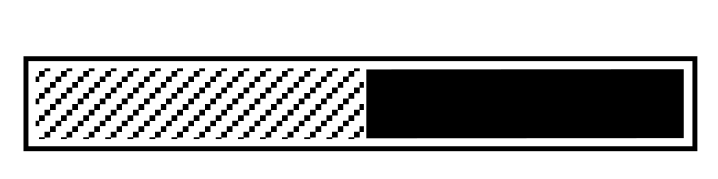

<h1 style="padding: 10px 0; font-family: 'Inter', sans-serif; font-size: 2.2em; color: #012c88fa;"> 
    Berkeley Class Loader v6.7
         
    </h1>
<h3 style="font-size: 0.5em; color: #FDB515">Berkeley Class Schedule to Google Calendar in 2 minutes!</h3>

Rest coming soon!

--
# Quick Start

Thanks for installing Berkeley Class Loader! Your class scheduling is going to get so much easier after this.

## Getting your schedule loaded

The first step is to load your schedule. First, go to your class scheduler tool and load the preferred schedule. It should look like this:

>>>>>  gd2md-html alert: inline image link here (to images/image1.png). Store image on your image server and adjust path/filename/extension if necessary.  (<a href="#">Back to top</a>)(<a href="#gdcalert2">Next alert</a>) >>>>> 

From here, we will load the schedule into the extension. Click BCL, and then convert the schedule. If everything works out, you should have your schedule loaded into the extension’s UI as a table.

## Setting section types

If you want to designate a class section as anything other than a lecture, you can with the drop-down menu under the **Type** column. You can set this as a discussion, lab, seminar, or even a DeCal. 

>>>>>  gd2md-html alert: inline image link here (to images/image2.png). Store image on your image server and adjust path/filename/extension if necessary.  (<a href="#">Back to top</a>)(<a href="#gdcalert3">Next alert</a>) >>>>> 

## Exporting and Importing

Here comes the fun part. Once you’ve reviewed that your classes are accurate and set the types, you can load them into Google Calendar or Apple Calendar.

(Important: Turn off **Ask where to save each file before downloading **before exporting.)

1. Click the **Export to Apple Calendar **or **Export to Google Calendar **button (depending on which one you want). That should prompt you to download a .ics file. Keep track of that.
2. If you’ve clicked on **Export to Google Calendar**, the extension should redirect you to a Google Calendar page. Upload the downloaded .ics file where it prompts you to. 

    (If you’re confused, it's also shown down here too!)

>>>>>  gd2md-html alert: inline drawings not supported directly from Docs. You may want to copy the inline drawing to a standalone drawing and export by reference. See <a href="https://github.com/evbacher/gd2md-html/wiki/Google-Drawings-by-reference">Google Drawings by reference</a> for details. The img URL below is a placeholder.  (<a href="#">Back to top</a>)(<a href="#gdcalert4">Next alert</a>) >>>>> 

3. If you clicked **Export to Apple Calendar**, double click on the file after it downloads. This should lead you to the Apple Calendar app, where you can import it.
4. That’s it! You saved 10 minutes of manual class scheduling.

**Bonus**: If you want it in your Apple Calendar and you’re using a Mac, clicking the .ics file in Finder will load it in automatically.

# Feedback?

Share questions, concerns, and new feature requests [here](https://docs.google.com/forms/d/1J7Vn3j5SFpj77GQztlUhlOsTt5qpzWNyEZ3EWsMCt_c/).

# FAQs

### Q: How to import my schedule file (.ics) into Google Calendar?

A: After clicking the “Export to Google Calendar” button, your schedule (in the form of a .ics file) should download to your drive. From there, upload it to the Google Calendar window (which will automatically open after clicking that button).

### Q: Why isn’t my calendar downloading automatically? (Save to Google Calendar)

A: If this is the case, turn off **Ask where to save each file before downloading** at chrome://settings/downloads. Don’t forget to turn it back on once you’re done.

### Q: Why isn’t the .ics file importing into my Apple Calendar?

A: Sometimes, it may take a few minutes for all the events to be imported into your calendar.

### Q: Why isn’t the extension working?  (Oh no! We can't do anything with this page.)

A: You probably aren’t on the Berkeley Schedule Planner. If you don’t know how to get there, the page is right [here](https://berkeley.collegescheduler.com/entry)  (Make sure you’re logged into CalCentral or it won’t work).

### Q: I’m getting an error (Failed: Could not establish connection. Receiving end does not exist.)

A: Reload the page, and it should work normally!

### Q: Why is the version 6.7?

A: …

<h2>More info at tinyurl.com/bcs-faq-howto</h2>

Credited Repositories

<ul>
    <li><a href="https://github.com/nwcell/ics.js/">ics.js by nwcell</a></li>
    <li><a href="https://github.com/eligrey/FileSaver.js">Filesaver.js by Eli Grey</a></li>
</ul>
